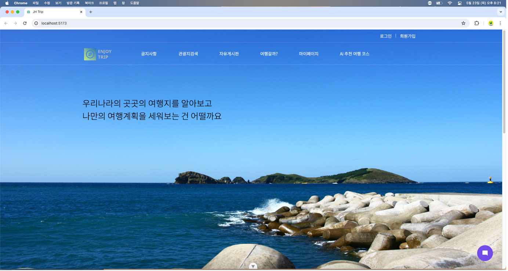
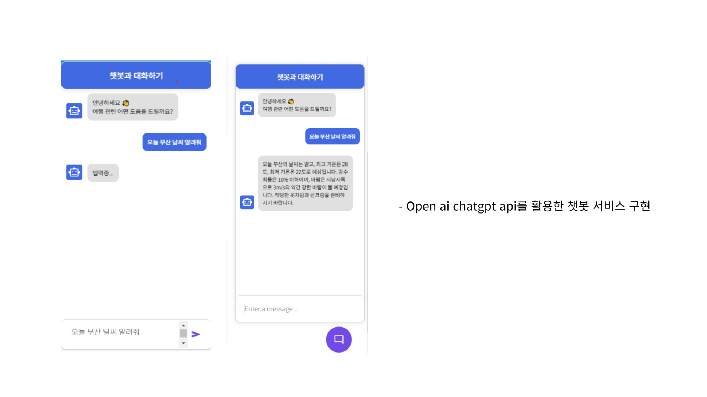
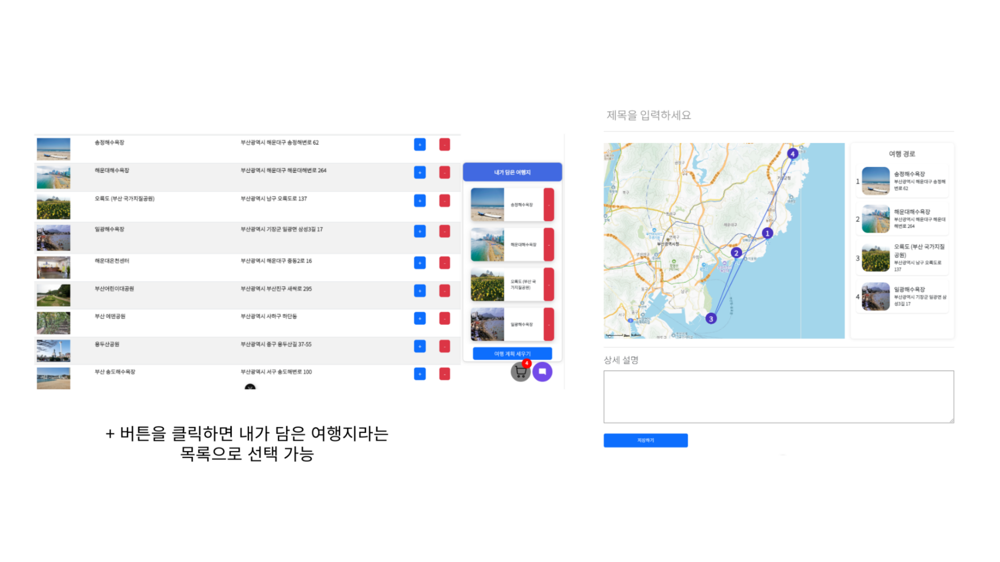
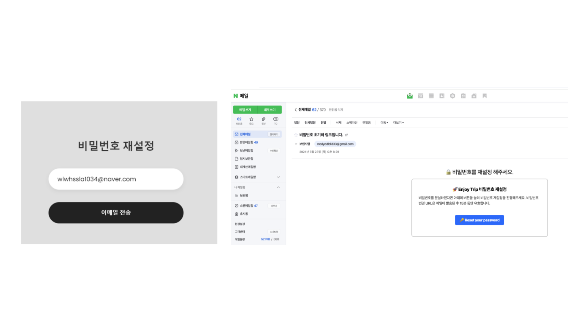
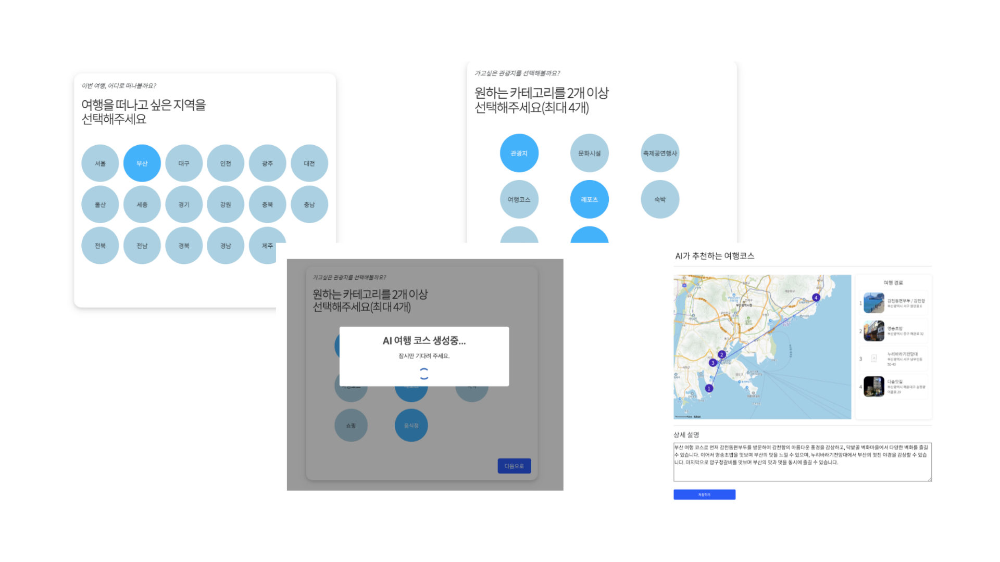
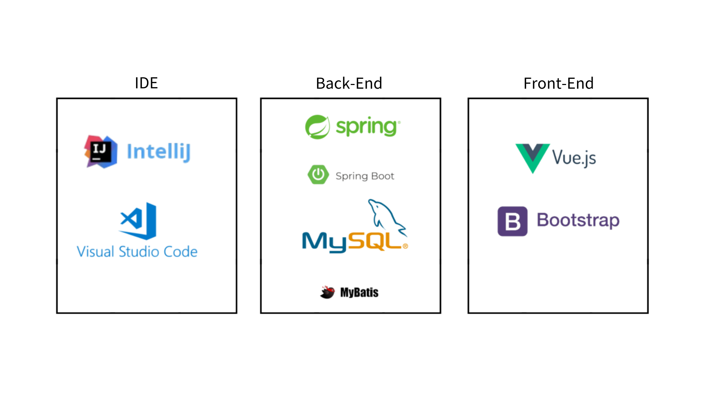

# ✈️ Enjoy Your Trip 🏝️

> **JH Trip**  
> 나만의 여행경로를 계획하고 남들과 공유하는 여행 플랫폼

## 🏖️ 프로젝트 소개

JHTrip은 지도와 관광지 데이터를 활용하여 사용자들이 쉽고 편리하게 여행 계획을 세울 수 있는 웹 플랫폼입니다.
사용자는 자신의 여행 코스와 계획을 작성하고, 리뷰와 경험을 공유할 수 있는 커뮤니티에서 다른 사람들과 소통할 수 있습니다.
또한, 생성형 AI를 통해 원하는 지역과 카테고리를 선택하면 AI가 맞춤형 여행 코스를 추천해주는 기능을 제공합니다.
JHTrip은 여행 준비 과정을 효율적으로 지원하며, 사용자 간의 교류를 통해 더욱 풍성한 여행 경험을 만들어 갑니다.

## 🏖️ 페이지 소개

### 1️⃣ **_Main Page_**

JHTrip 메인 페이지입니다. 여러 개의 이미지가 랜덤으로 랜더링됩니다.

### 2️⃣ **_Chat Bot_**

페이지 우측 하단에 챗봇 버튼을 클릭하면 챗봇을 사용할 수 있습니다.  
챗봇은 생성형 AI 기반으로 답변을 생성하며 기상정보나 간단한 관광지 정보를 물어볼 수 있습니다.

### 3️⃣ **여행 계획**

지도 API와 관광지 데이터를 기반으로 관광지나 식당 등을 여행 코스로 구성하여 여행계획을 세울 수 있습니다.

### 4️⃣ **회원관리(비밀번호 찾기)**

비밀번호 찾기는 SMTP를 활용하여 이메일로 임시 토큰을 발급하여 5분 이내에 링크에 접속했을 때만 유효한 URL을 이메일로 전송합니다.
유효한 URL을 통해 비밀번호를 재설정할 수 있습니다.

### 5️⃣ **AI 추천 여행코스**

생성형 AI와 관광지 데이터를 활용하여 지역과 카테고리를 통해 AI가 여행코스를 추천해줍니다.

## 🏖️ 주요 구현 사항

- **프론트엔드:** Vue.js 이용하여 사용자 친화적 UI 디자인 및 구현 및 Map API 활용
- **백엔드:** Spring Boot를 통해 CRUD 기능을 제공하는 REST API 개발
- **데이터베이스:** MySQL 데이터베이스 설계 및 Mybatis를 사용하여 데이터 매핑
- **AI 기능:** 생성형 AI를 활용하여 사용자의 입력 정보를 기반으로 맞춤형 여행코스 추천

## 🏖️ 기술 스택 및 개발 환경

**API:** ChatGPT API, Kakao Map API

## 🏖️ 성과 및 학습

**성과:**

- 짧은 기간 내에 완성도가 높은 웹 사이트 구축
- ChatGPT 활용한 AI 여행 코스 추천 기능을 통해 사용자 만족도 증대

**학습:**

- Spring Boot와 Vue.js 사용한 풀스택 개발 경험
- 데이터베이스 연동 및 관리 기술 향상
- 프롬프트 엔지니어링 및 AI 모델 활용한 개발 경험

## ⭐ 팀원 소개

|                                     |                                                                                                                                                              |                                      |                                                                                                                                                                 |
| ----------------------------------- | ------------------------------------------------------------------------------------------------------------------------------------------------------------ | ------------------------------------ | --------------------------------------------------------------------------------------------------------------------------------------------------------------- |
|  | **HaHyul Kim**   Frontend   UI/UX 디자인 및 FE 구현   Chatbot 서비스 구현   서버와의 통신(비동기 처리)   [GitHub](https://github.com/busangangster)   gkgbf1034@gmail.com |  | **Jaeyong Choi**   Backend   백엔드 개발 및 API 설계   ERD 설계 및 데이터 매핑   AI 여행경로 추천 (프롬프팅)   [GitHub](https://github.com/wodyddldl333)   wodyddldl333@naver.com |

 

`전체적으로는 백엔드와 프론트엔드의 역할을 분담하여 진행했지만, 프로젝트의 완성도를 높이기 위해 모든 팀원이 풀스택 개발자로서 협업하며 개발을 진행했습니다.`

`각각의 역할에 따라 맡은 부분이 있었지만, 서로의 영역을 넘나들며 적극적으로 참여해 프로젝트를 성공적으로 완수했습니다.`